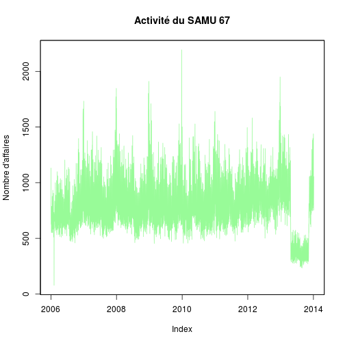

Analyse SAMU
========================================================


```r
library("xts")
```

```
## Loading required package: zoo
## 
## Attaching package: 'zoo'
## 
## Les objets suivants sont masqués from 'package:base':
## 
##     as.Date, as.Date.numeric
```

```r
library("zoo")
library("lubridate")

load("samu_archive.Rda")

s67 <- d[d$service == "SAMU 67", ]
# supprime les lignes dupliquées:
s67 <- s67[!duplicated(s67$date), ]

xts_s67 <- as.xts(s67, order.by = s67$date)

a <- zoo(s67$affaires, s67$date)
plot(a, col = "palegreen", main = "Activité du SAMU 67", ylab = "Nombre d'affaires")
```

 

```r

b <- zoo(s67$conseils, s67$date)
plot(b, col = "paleorange", main = "Activité du SAMU 67", ylab = "Nombre de conseils")
```

```
## Error: nom de couleur 'paleorange' incorrecte
```

 

```r


a <- tapply(s67$affaires, year(s67$date), sum)
# activité en nombre d'affaires
a
```

```
##   2006   2007   2008   2009   2010   2011   2012   2013   2014 
## 258065 291264 287750 286857 279600 290592 323647 223414   4961
```

```r

boxplot(s67$affaires ~ year(s67$date), main = "Activité du SAMU 67", ylab = "Nombre d'affaires")

ord <- order(s67$affaires, decreasing = TRUE)
s67[ord[1], ]
```

```
##            date service affaires primaires secondaires néonat TIIH ASSU
## 2176 2009-12-26 SAMU 67     2194        54           5      0    0  137
##      VSAV conseils Medecins
## 2176   34      200      581
```

```r
s67$date[ord[1]]
```

```
## [1] "2009-12-26"
```

```r
text(4, s67$affaires[ord[1]], s67$date[ord[1]], cex = 0.6, pos = 4)
```


