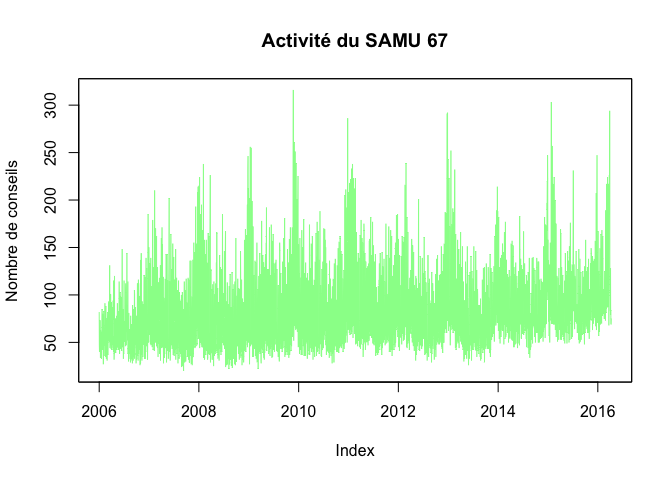
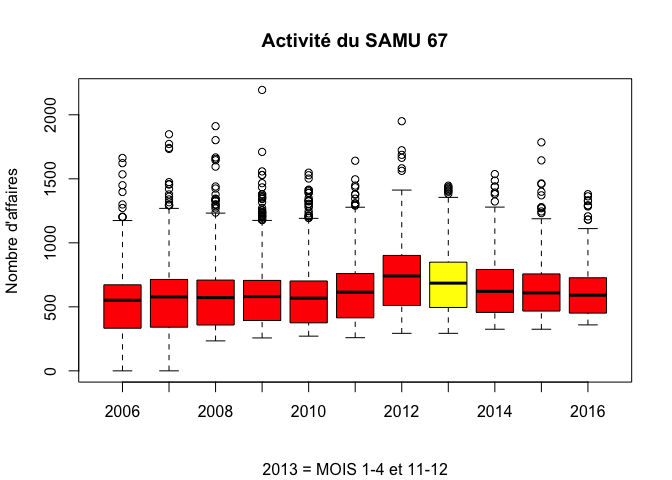
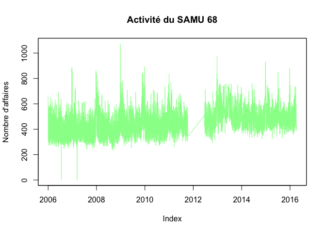
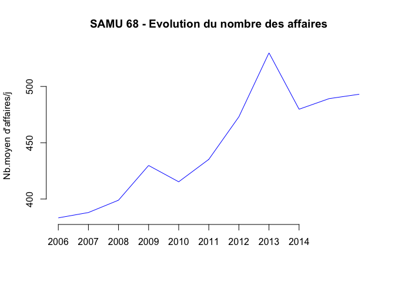
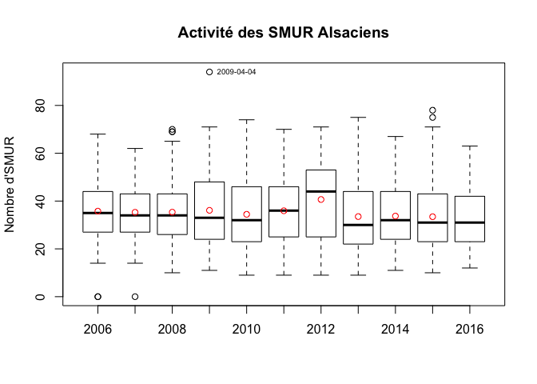

# Activité des SAMU : panorama 2014 de la région ALSACE
RESURAL (JcB)  
28/01/2015  

Analyse SAMU
========================================================


```r
library(knitr)
library("xts")
```

```
## Loading required package: zoo
```

```
## 
## Attaching package: 'zoo'
```

```
## The following objects are masked from 'package:base':
## 
##     as.Date, as.Date.numeric
```

```r
library("zoo")
library("lubridate")
```

```
## 
## Attaching package: 'lubridate'
```

```
## The following object is masked from 'package:base':
## 
##     date
```

```r
# supprimer la notation scientifique et ajouter un séparateur de milliers
options(scipen = 6, digits = 2)
knit_hooks$set(inline = function(x) {
  prettyNum(x, big.mark=" ")
})

load("samu_archive.Rda") # d

names(d)
```

```
##  [1] "date"        "service"     "affaires"    "primaires"   "secondaires"
##  [6] "néonat"      "TIIH"        "ASSU"        "VSAV"        "conseils"   
## [11] "Medecins"
```

```r
min(d$date)
```

```
## [1] "2006-01-01"
```

```r
max(d$date)
```

```
## [1] "2016-04-08"
```

```r
pop67 <- 1095905
pop68 <- 749782
pop.als.2010.municipale<-1095905 + 749782

# on met à NA les enregistrements où le nombre d'affaires < 10


# année courante et nb de jours
an_c <- 2016

d <- d[year(d$date) < an_c+1,]

j1 <- as.Date(paste0(an_c,"-01-01"))
j2 <- as.Date(paste0(an_c,"-12-31"))
n <- as.numeric(j2-j1) + 1
n
```

```
## [1] 366
```

```r
names(d)
```

```
##  [1] "date"        "service"     "affaires"    "primaires"   "secondaires"
##  [6] "néonat"      "TIIH"        "ASSU"        "VSAV"        "conseils"   
## [11] "Medecins"
```

```r
str(d)
```

```
## 'data.frame':	7220 obs. of  11 variables:
##  $ date       : Date, format: "2006-12-31" "2006-12-30" ...
##  $ service    : Factor w/ 2 levels "SAMU 67","SAMU 68": 1 1 1 1 1 1 1 1 1 1 ...
##  $ affaires   : num  1450 1202 753 744 851 ...
##  $ primaires  : num  34 36 20 37 41 36 28 40 48 48 ...
##  $ secondaires: num  5 8 12 8 10 2 6 3 7 11 ...
##  $ néonat     : num  0 0 0 0 0 0 0 0 0 0 ...
##  $ TIIH       : num  0 0 0 0 0 0 0 0 0 0 ...
##  $ ASSU       : num  124 110 80 75 123 108 115 96 100 101 ...
##  $ VSAV       : num  18 6 13 13 12 11 12 12 18 15 ...
##  $ conseils   : num  150 92 50 84 64 145 185 145 117 47 ...
##  $ Medecins   : num  329 209 76 62 61 371 337 354 151 51 ...
```

```r
summary(d)
```

```
##       date               service        affaires      primaires 
##  Min.   :2006-01-01   SAMU 67:3748   Min.   :   0   Min.   : 0  
##  1st Qu.:2008-07-01   SAMU 68:3472   1st Qu.: 414   1st Qu.:19  
##  Median :2010-12-21                  Median : 586   Median :28  
##  Mean   :2011-02-09                  Mean   : 617   Mean   :28  
##  3rd Qu.:2013-10-17                  3rd Qu.: 742   3rd Qu.:37  
##  Max.   :2016-04-08                  Max.   :2194   Max.   :89  
##   secondaires     néonat         TIIH        ASSU          VSAV    
##  Min.   : 0   Min.   :0.0   Min.   :0   Min.   :  0   Min.   :  0  
##  1st Qu.: 4   1st Qu.:0.0   1st Qu.:0   1st Qu.: 26   1st Qu.: 21  
##  Median : 6   Median :0.0   Median :0   Median : 83   Median : 37  
##  Mean   : 7   Mean   :0.7   Mean   :0   Mean   : 70   Mean   : 45  
##  3rd Qu.: 9   3rd Qu.:1.0   3rd Qu.:0   3rd Qu.:103   3rd Qu.: 70  
##  Max.   :34   Max.   :8.0   Max.   :7   Max.   :160   Max.   :147  
##     conseils      Medecins  
##  Min.   :  0   Min.   :  0  
##  1st Qu.: 63   1st Qu.: 40  
##  Median :107   Median : 54  
##  Mean   :121   Mean   : 86  
##  3rd Qu.:149   3rd Qu.:112  
##  Max.   :599   Max.   :593
```

```r
# nombre d'année dans la base:
table(year(d$date))
```

```
## 
## 2006 2007 2008 2009 2010 2011 2012 2013 2014 2015 2016 
##  714  726  729  735  726  646  559  731  735  722  197
```

```r
# nombre d'affaires par an:
taf <- tapply(d$affaires, year(d$date), sum)

# nombre moyen d'affaires
maf <- tapply(d$affaires, year(d$date), mean)

# écart-type nombre d'affaires
saf <- tapply(d$affaires, year(d$date), sd)

# primaires
tpr <- tapply(d$primaires, year(d$date), sum)
# secondaires
tse <- tapply(d$secondaires, year(d$date), sum)
# SMUR
tsm <- tpr+tse
# ASSU
tas <- tapply(d$ASSU, year(d$date), sum)
# VSAV
tvs <- tapply(d$VSAV, year(d$date), sum)
# Conseils
tco <- tapply(d$conseils, year(d$date), sum)
# visites
tme <- tapply(d$Medecins, year(d$date), sum)

t <- rbind(taf,tco,tsm,tas,tvs,tme)
rownames(t) <- c("Affaires","Conseils","SMUR","ASSU","VSAV","Médecins")
t
```

```
##            2006   2007   2008   2009   2010   2011   2012   2013   2014
## Affaires 394904 431340 432576 446044 429529 412890 414947 417157 480303
## Conseils  86124  79961  81572  94640  84969  77585  58646  87921  91412
## SMUR      25547  25625  25766  26545  25015  23214  22724  24494  24784
## ASSU      57243  63190  61788  40807  46350  44360  42366  42167  46031
## VSAV      22779  23379  29168  33984  33238  29169  25213  40281  41475
## Médecins  55588  67981  69448  74293  65509  59062  48704  53820  54723
##            2015   2016
## Affaires 465320 126986
## Conseils  96801  30483
## SMUR      24153   6338
## ASSU      48452  14090
## VSAV      39539   9309
## Médecins  52956  16270
```

Bilan régional
==============

```
## [1] "Année 2014"
```

```
##    affaires   primaires secondaires      néonat        TIIH        ASSU 
##      480303       19714        5070         537           0       46031 
##        VSAV    conseils    Medecins 
##       41475       91412       54723
```

```
## [1] "Par jour:"
```

```
##    affaires   primaires secondaires      néonat        TIIH        ASSU 
##      1315.9        54.0        13.9         1.5         0.0       126.1 
##        VSAV    conseils    Medecins 
##       113.6       250.4       149.9
```


Records
=======

maximaux
---------

```r
d[d$affaires==max(d$affaires, na.rm=T) & !is.na(d$date),]
```

```
##            date service affaires primaires secondaires néonat TIIH ASSU
## 2176 2009-12-26 SAMU 67     2194        54           5      0    0  137
##      VSAV conseils Medecins
## 2176   34      200      581
```

```r
d[d$primaires==max(d$primaires, na.rm=T) & !is.na(d$date),]
```

```
##            date service affaires primaires secondaires néonat TIIH ASSU
## 2442 2009-04-04 SAMU 67     1168        89           5      0    0  131
##      VSAV conseils Medecins
## 2442   19      105      194
```

```r
d[d$secondaires==max(d$secondaires, na.rm=T) & !is.na(d$date),]
```

```
##            date service affaires primaires secondaires néonat TIIH ASSU
## 1715 2008-04-02 SAMU 67      740        36          34      1    0  103
##      VSAV conseils Medecins
## 1715   14       39       68
```

```r
d[d$ASSU==max(d$ASSU, na.rm=T) & !is.na(d$date),]
```

```
##            date service affaires primaires secondaires néonat TIIH ASSU
## 1807 2008-01-01 SAMU 67     1667        46           5      1    0  160
##      VSAV conseils Medecins
## 1807   26      215      308
```

```r
d[d$VSAV==max(d$VSAV, na.rm=T) & !is.na(d$date),]
```

```
##            date service affaires primaires secondaires néonat TIIH ASSU
## 6842 2015-07-05 SAMU 68      853        23          12      0    0   35
##      VSAV conseils Medecins
## 6842  147      315      179
```

```r
d[d$conseils==max(d$conseils, na.rm=T) & !is.na(d$date),]
```

```
##           date service affaires primaires secondaires néonat TIIH ASSU
## 363 2006-12-26 SAMU 68      888        16           7      1    0   73
##     VSAV conseils Medecins
## 363   38      599      403
```

```r
d[d$Medecins==max(d$Medecins, na.rm=T) & !is.na(d$date),]
```

```
##            date service affaires primaires secondaires néonat TIIH ASSU
## 1447 2008-12-26 SAMU 67     1911        51           5      1    0  126
##      VSAV conseils Medecins
## 1447   38      246      593
```
minimaux
--------

```r
d[d$affaires==min(d$affaires, na.rm=T) & !is.na(d$date),]
```

```
##            date service affaires primaires secondaires néonat TIIH ASSU
## 483  2006-08-29 SAMU 68        0         0           0      0    0    0
## 524  2006-07-19 SAMU 68        0         0           0      0    0    0
## 1368 2007-03-15 SAMU 68        0         0           0      0    0    0
##      VSAV conseils Medecins
## 483     0        0        0
## 524     0        0        0
## 1368    0        0        0
```

```r
d[d$primaires==min(d$primaires, na.rm=T) & !is.na(d$date),]
```

```
##            date service affaires primaires secondaires néonat TIIH ASSU
## 483  2006-08-29 SAMU 68        0         0           0      0    0    0
## 524  2006-07-19 SAMU 68        0         0           0      0    0    0
## 1368 2007-03-15 SAMU 68        0         0           0      0    0    0
##      VSAV conseils Medecins
## 483     0        0        0
## 524     0        0        0
## 1368    0        0        0
```

```r
d[d$secondaires==min(d$secondaires, na.rm=T) & !is.na(d$date),]
```

```
##            date service affaires primaires secondaires néonat TIIH ASSU
## 77   2006-10-17 SAMU 67      608        38           0      0    7   86
## 377  2006-12-12 SAMU 68      307        19           0      0    0   63
## 380  2006-12-09 SAMU 68      430        17           0      0    0   72
## 387  2006-12-02 SAMU 68      438        27           0      0    0   67
## 483  2006-08-29 SAMU 68        0         0           0      0    0    0
## 524  2006-07-19 SAMU 68        0         0           0      0    0    0
## 578  2006-05-27 SAMU 68      492        33           0      0    0   93
## 591  2006-05-14 SAMU 68      485        26           0      0    0   58
## 607  2006-04-27 SAMU 68      303        16           0      0    0   68
## 654  2006-03-05 SAMU 68      621        34           0      0    0   87
## 795  2007-10-13 SAMU 67      840        37           0      1    0  101
## 1123 2007-11-18 SAMU 68      480        17           0      0    0   76
## 1262 2007-07-02 SAMU 68      336        26           0      0    0   77
## 1335 2007-04-20 SAMU 68      306        17           0      0    0   53
## 1368 2007-03-15 SAMU 68        0         0           0      0    0    0
## 1460 2008-12-13 SAMU 67      848        27           0      1    0  115
## 1874 2008-10-25 SAMU 68      429        27           0      0    0   76
## 1946 2008-08-14 SAMU 68      333        18           0      0    0   62
## 1952 2008-08-08 SAMU 68      292        11           0      0    0   54
## 1990 2008-06-30 SAMU 68      372        29           0      0    0   70
## 2086 2008-03-25 SAMU 68      366        19           0      0    0   60
## 2288 2009-09-05 SAMU 67      713        40           0      0    0  101
## 2607 2009-10-25 SAMU 68      490        20           0      0    0    0
## 2863 2009-02-15 SAMU 68      646        18           0      0    0    0
## 2872 2009-02-06 SAMU 68      357        15           0      0    0    0
## 3135 2010-05-16 SAMU 67     1277        32           0      0    0   94
## 3593 2010-02-08 SAMU 68      358        16           0      0    0   16
## 3667 2011-11-26 SAMU 67      833        30           0      0    0   83
## 3722 2011-10-02 SAMU 67     1297        30           0      0    0  111
## 3975 2011-01-22 SAMU 67      972        28           0      0    0  100
## 4058 2011-08-11 SAMU 68      333        17           0      0    0   17
## 4287 2012-12-22 SAMU 67     1339        59           0      0    0  109
## 4613 2012-01-31 SAMU 67      733        41           0      0    0  106
## 4787 2012-08-09 SAMU 68      437        15           0      0    0   15
## 4882 2013-06-16 SAMU 67      574        46           0      0    0   90
## 5157 2013-04-14 SAMU 68      750        23           0      0    0   23
## 5388 2013-10-27 SAMU 67      459        22           0      0    0   76
## 5418 2013-10-28 SAMU 68      432        17           0      0    0   17
## 5714 2014-05-18 SAMU 67      952        36           0      0    0   98
## 5757 2014-04-05 SAMU 67      809        36           0      0    0  107
## 5764 2014-03-29 SAMU 67      981        34           0      1    0  121
## 6560 2015-04-18 SAMU 67      855        36           0      0    0   85
## 6821 2015-07-26 SAMU 68      532        12           0      0    0   12
## 7175 2016-02-17 SAMU 68      364        19           0      0    0   19
##      VSAV conseils Medecins
## 77     11       47       51
## 377    52      102       39
## 380    53      190      126
## 387    58      187      145
## 483     0        0        0
## 524     0        0        0
## 578    66      308      123
## 591    57      398      127
## 607    41      135       38
## 654    59      422      153
## 795    17      100      129
## 1123   33      208      165
## 1262   63      102       45
## 1335   48       87       44
## 1368    0        0        0
## 1460   19      106      194
## 1874   66      170      109
## 1946   62      133       36
## 1952   45      120       34
## 1990   86      132       48
## 2086   59      124       41
## 2288   18       97      141
## 2607   83      199      172
## 2863   94      246      228
## 2872   72      131       38
## 3135   29      177      214
## 3593   64      145       51
## 3667   21      131      140
## 3722   27      175      257
## 3975   23      121      170
## 4058   65      111       38
## 4287   34      129      235
## 4613   20       59       50
## 4787  102      106       34
## 4882   44      141      179
## 5157  109      190      109
## 5388   15       92      199
## 5418   72      133       27
## 5714   18      120      168
## 5757   34       75      126
## 5764   31      120      132
## 6560   28       92      103
## 6821   69      255      104
## 7175   52      129       21
```

```r
# d[d$ASSU==min(d$ASSU, na.rm=T) & !is.na(d$date),]
# d[d$VSAV==min(d$VSAV, na.rm=T) & !is.na(d$date),]
# d[d$conseils==min(d$conseils, na.rm=T) & !is.na(d$date),]
# d[d$Medecins==min(d$Medecins, na.rm=T) & !is.na(d$date),]
```

SAMU 67
========


```r
s67 <- d[d$service == "SAMU 67",]
# supprime les lignes dupliquées:
s67 <- s67[!duplicated(s67$date),]
# nombre d'affaires
n_67_affaires <- sum(s67$affaires)

s_s67 <- summary(s67)

xts_s67 <- as.xts(s67, order.by = s67$date)

a <- zoo(s67$affaires, s67$date)
plot(a, col="palegreen", main="Activité du SAMU 67", ylab="Nombre d'affaires")
```


```r
b <- zoo(s67$conseils, s67$date)
plot(b, col="palegreen", main="Activité du SAMU 67", ylab="Nombre de conseils")
```



```r
a <- tapply(s67$affaires,year(s67$date),sum)
# activité en nombre d'affaires
a
```

```
##   2006   2007   2008   2009   2010   2011   2012   2013   2014   2015 
## 258065 291264 287750 286857 279600 290592 323647 223414 299899 290675 
##   2016 
##  78663
```

```r
# moyenne des dossiers:
a <- tapply(s67$affaires,year(s67$date),mean)

b <- tapply(s67$affaires,year(s67$date),sd)
c <- rbind(a,b)
rownames(c) <- c("moy","e-type")
c
```

```
##        2006 2007 2008 2009 2010 2011 2012 2013 2014 2015 2016
## moy     725  798  786  786  766  796  884  612  822  796  795
## e-type  195  237  236  240  220  207  207  321  180  191  223
```

```r
plot(a, type="l", ylab="Nb.moyen d'affaires/j",xlab="",main="SAMU 67 - Evolution du nombre des affaires", axes = FALSE, col="blue")
axis(1,1:9,labels = c(2006:2014))
axis(2)
```


```r
# box plot. On détermine la journée la plus active en triant les enregistrements par nb affaires décroissant. ord[1] correspond à la ligne où le nb d'affaires est le plus élevé. Il s'agxit de 2006, ce qui correspond à la colonne n°4. On marque la date en face du repère.

# moyenne annuelle
moy67 <- tapply(s67$affaires,year(s67$date),mean)

boxplot(s67$affaires ~ year(s67$date), main="Activité du SAMU 67", ylab="Nombre d'affaires")
for(i in 1:9){points(i,moy67[i],col="red")}

ord <- order(s67$affaires,decreasing=TRUE)
s67[ord[1],]
```

```
##            date service affaires primaires secondaires néonat TIIH ASSU
## 2176 2009-12-26 SAMU 67     2194        54           5      0    0  137
##      VSAV conseils Medecins
## 2176   34      200      581
```

```r
s67$date[ord[1]]
```

```
## [1] "2009-12-26"
```

```r
text(4, s67$affaires[ord[1]], s67$date[ord[1]],cex=.6,pos=4)
```


#### chiffres résumés sur la période 2006 - 2 016:

- nombre d'affaires: 2 910 426
- moyenne des affaires/j: Mean   : 778  
- médiane des affaires/j: Median : 724  
- nombre maximal d' affaires/j: Max.   :2194  
- nombre minimal d' affaires/j: Min.   :  78  

bilan de l'année 2 016
----------------
En 2013, une erreur informatique a entraîné une erreur dans le report de l'activité du SAMU67 du 24 avril 2013 au 1er novembre 2013, soit un peu plus de 6 mois:

- **ac67** correspond à l'ensemble de l'année 2013
- **ac67c** correspond aux mois 1-4 et 11-12 de 2013


```r
ac67 <- s67[year(s67$date) == an_c,]
# nombre de jours renseignés
x <- as.numeric(max(ac67$date, na.rm=T) - min(ac67$date, na.rm=T))
round(x * 100 / n, 2)
```

```
## [1] 27
```

```r
#nb affaires:
n_ac67_af <- sum(ac67$affaires, na.rm=T)
sac67_af <- summary(ac67$affaires)
sac67_af
```

```
##    Min. 1st Qu.  Median    Mean 3rd Qu.    Max. 
##     503     627     711     795     918    1380
```

```r
# nb primaires
n_ac67_pr <- sum(ac67$primaires)
sac67_pr <- summary(ac67$primaires)
sac67_pr
```

```
##    Min. 1st Qu.  Median    Mean 3rd Qu.    Max. 
##      15      29      33      33      38      48
```

```r
# nb secondaires
n_ac67_tr <- sum(ac67$secondaires)
sac67_tr <- summary(ac67$secondaires)
sac67_tr
```

```
##    Min. 1st Qu.  Median    Mean 3rd Qu.    Max. 
##     2.0     5.0     7.0     7.3     9.0    16.0
```

```r
# nb de SMUR (primaires + secondaires)
p <- ac67$primaires
t <- ac67$secondaires
s <- p + t
n_smur67 <- sum(s, na.rm=T)
n_smur67
```

```
## [1] 4029
```

```r
s_smur67 <- summary(s)
# nb de mise en oeuvre d'ASSU
n_ac67_as <- sum(ac67$ASSU)
sac67_as <- summary(ac67$ASSU)
sac67_as
```

```
##    Min. 1st Qu.  Median    Mean 3rd Qu.    Max. 
##      98     112     119     119     124     158
```

```r
# nb de mise en oeuvre de VSAV à la demande du SAMU
n_ac67_vs <- sum(ac67$VSAV)
sac67_vs <- summary(ac67$VSAV)
sac67_vs
```

```
##    Min. 1st Qu.  Median    Mean 3rd Qu.    Max. 
##      12      20      24      24      28      39
```

```r
# nombre de conseils médicaux
n_ac67_cs <- sum(ac67$conseils)
sac67_cs <- summary(ac67$conseils)
sac67_cs
```

```
##    Min. 1st Qu.  Median    Mean 3rd Qu.    Max. 
##      57      81      89     109     125     294
```

```r
# nombre de Médecins déclenchés par le SAMU
n_ac67_md <- sum(ac67$Medecins)
sac67_md <- summary(ac67$Medecins)
sac67_md
```

```
##    Min. 1st Qu.  Median    Mean 3rd Qu.    Max. 
##      29      44      54     102     138     370
```

```r
# comparaison avec l'année précédante:
ap67 <- s67[year(s67$date) == an_c-1,]
sap67 <- summary(ap67)
sap67
```

```
##       date               service       affaires      primaires 
##  Min.   :2015-01-01   SAMU 67:365   Min.   : 459   Min.   :11  
##  1st Qu.:2015-04-02   SAMU 68:  0   1st Qu.: 661   1st Qu.:31  
##  Median :2015-07-02                 Median : 752   Median :36  
##  Mean   :2015-07-02                 Mean   : 796   Mean   :36  
##  3rd Qu.:2015-10-01                 3rd Qu.: 901   3rd Qu.:41  
##  Max.   :2015-12-31                 Max.   :1785   Max.   :71  
##   secondaires       néonat         TIIH        ASSU          VSAV   
##  Min.   : 0.0   Min.   :0.0   Min.   :0   Min.   : 81   Min.   : 9  
##  1st Qu.: 5.0   1st Qu.:0.0   1st Qu.:0   1st Qu.:102   1st Qu.:24  
##  Median : 7.0   Median :1.0   Median :0   Median :108   Median :29  
##  Mean   : 7.1   Mean   :1.3   Mean   :0   Mean   :110   Mean   :29  
##  3rd Qu.: 9.0   3rd Qu.:2.0   3rd Qu.:0   3rd Qu.:117   3rd Qu.:34  
##  Max.   :18.0   Max.   :5.0   Max.   :0   Max.   :154   Max.   :65  
##     conseils      Medecins  
##  Min.   : 48   Min.   : 24  
##  1st Qu.: 70   1st Qu.: 45  
##  Median : 84   Median : 55  
##  Mean   : 93   Mean   : 91  
##  3rd Qu.:108   3rd Qu.:123  
##  Max.   :303   Max.   :474
```

```r
# analyse en ne trenant compte que des mois pleins (mois 1-4 et 11-12)
ac67c <- ac67[ac67$date < "2013-04-24" | ac67$date > "2013-11-01",]
summary(ac67c)
```

```
##       date               service      affaires      primaires 
##  Min.   :2016-01-01   SAMU 67:99   Min.   : 503   Min.   :15  
##  1st Qu.:2016-01-25   SAMU 68: 0   1st Qu.: 627   1st Qu.:29  
##  Median :2016-02-19                Median : 711   Median :33  
##  Mean   :2016-02-19                Mean   : 795   Mean   :33  
##  3rd Qu.:2016-03-14                3rd Qu.: 918   3rd Qu.:38  
##  Max.   :2016-04-08                Max.   :1380   Max.   :48  
##   secondaires       néonat         TIIH        ASSU          VSAV   
##  Min.   : 2.0   Min.   :0.0   Min.   :0   Min.   : 98   Min.   :12  
##  1st Qu.: 5.0   1st Qu.:0.5   1st Qu.:0   1st Qu.:112   1st Qu.:20  
##  Median : 7.0   Median :1.0   Median :0   Median :119   Median :24  
##  Mean   : 7.3   Mean   :1.5   Mean   :0   Mean   :119   Mean   :24  
##  3rd Qu.: 9.0   3rd Qu.:2.0   3rd Qu.:0   3rd Qu.:124   3rd Qu.:28  
##  Max.   :16.0   Max.   :6.0   Max.   :0   Max.   :158   Max.   :39  
##     conseils      Medecins  
##  Min.   : 57   Min.   : 29  
##  1st Qu.: 81   1st Qu.: 44  
##  Median : 89   Median : 54  
##  Mean   :109   Mean   :102  
##  3rd Qu.:125   3rd Qu.:138  
##  Max.   :294   Max.   :370
```

```r
x <- d[d$date < "2013-04-24" | d$date >  "2013-11-01", c("date","affaires")]
boxplot(x$affaires ~ year(x$date), main="Activité du SAMU 67", ylab="Nombre d'affaires", sub="2013 = MOIS 1-4 et 11-12", col=c("red","red","red","red","red","red","red","yellow","red"))
```


#### chiffres résumés sur l'année 2 016 pour la SAMU 67:
- nombre d'affaires: 78 663
- moyenne des affaires/j: 795
- médiane des affaires/j: 711
- nombre maximal d' affaires/j: 1 380
- nombre minimal d' affaires/j: 503

- nombre d'intervention SMUR: 4 029
- nombre moyen d'interventions SMUR: 41


SAMU 68
=======

```r
s68 <- d[d$service == "SAMU 68",]
# supprime les lignes dupliquées:
s68 <- s68[!duplicated(s68$date),]

# nombre de jours renseignés
x <- max(s68$date) - min(s68$date)
round(x * 100 / n, 2)
```

```
## Time difference of 1025 days
```

```r
xts_s68 <- as.xts(s68, order.by = s68$date)

a <- zoo(s68$affaires, s68$date)
plot(a, col="palegreen", main="Activité du SAMU 68", ylab="Nombre d'affaires")
```



```r
b <- zoo(s68$conseils, s68$date)
plot(b, col="palegreen", main="Activité du SAMU 68", ylab="Nombre de conseils")
```


```r
a <- tapply(s68$affaires,year(s68$date),sum)
# activité en nombre d'affaires
a
```

```
##   2006   2007   2008   2009   2010   2011   2012   2013   2014   2015 
## 136443 140076 144826 154304 149929 122298  91300 192868 172720 174645 
##   2016 
##  48323
```

```r
# myenne annuelle
moy68 <- tapply(s68$affaires,year(s68$date),mean)
moy68
```

```
## 2006 2007 2008 2009 2010 2011 2012 2013 2014 2015 2016 
##  383  388  399  430  415  435  473  530  480  489  493
```

```r
plot(moy68, type="l", ylab="Nb.moyen d'affaires/j",xlab="",main="SAMU 68 - Evolution du nombre des affaires", axes = FALSE, col="blue")
axis(1,1:9,labels = c(2006:2014))
axis(2)
```



```r
# box plot. On détermine la journée la plus active en triant les enregistrements par nb affaires décroissant. ord[1] correspond à la ligne où le nb d'affaires est le plus élevé. Il s'agit de 2006, ce qui correspond à la colonne n°4. On marque la date en face du repère.
# De plus on ajoute la valeur moyenne sous forme de de rond rouges:

boxplot(s68$affaires ~ year(s68$date), main="Activité du SAMU 68", ylab="Nombre d'affaires")
for(i in 1:9){points(i,moy68[i],col="red")}

ord <- order(s68$affaires,decreasing=TRUE)
s68[ord[1],]
```

```
##            date service affaires primaires secondaires néonat TIIH ASSU
## 1813 2008-12-26 SAMU 68     1074        18           4      0    0    0
##      VSAV conseils Medecins
## 1813  107      556      474
```

```r
s68$date[ord[1]]
```

```
## [1] "2008-12-26"
```

```r
text(4, s68$affaires[ord[1]], s68$date[ord[1]],cex=.6,pos=4)
```


Les 2 SAMU ensembles
--------------------
- **at** permet de décaler les boxplot pour qu'ils ne soient pas superposés
- **boxwex** permet de diminuer la largeur d'un boxplot
- **add** pour mettre les 2 graphiques sur le même dessin
- **outline** = FALSE, ne dessine pas les observations extrèmes


```r
# x <- d[d$date < "2013-04-24" | d$date >  "2013-11-01", c("date","affaires")]
# n <- unique(year(x$date)) # nombre d'années
# 
# boxplot(x$affaires ~ year(x$date), main="Activité du SAMU 67", ylab="Nombre d'affaires", sub="2013 = MOIS 1-4 et 11-12", col=c("red","red","red","red","red","red","red","yellow","red"))
# 
# boxplot(x$affaires ~ year(x$date), main="Activité des SAMU d'Alsace", ylab="Nombre d'affaires", sub="MOIS 1-4 et 11-12", col=c("red","red","red","red","red","red","red","yellow","red"), at = 1:9 - 0.3, boxwex=0.25, outline=FALSE)

# décommenter la ligne suivante:
# boxplot(s68$affaires ~ year(s68$date), col="green", add=TRUE, at = 1:9+0.1, boxwex=0.25, names=c("","","","","","","","",""), outline=FALSE)
# 
# legend(1, 1400, c("SAMU 67 ", "SAMU 68"), fill = c("red", "green"))
```


```r
# Boxplot de l'activité SMUR
#---------------------------
d$SMUR <- d$primaires + d$secondaires
moy_als <- tapply(d$SMUR, year(d$date), mean) # activité moyenne par
periode <- 10
boxplot(d$SMUR ~ year(d$date), main = "Activité des SMUR Alsaciens", ylab = "Nombre d'SMUR")
for (i in 1:periode) { points(i, moy_als[i], col = "red")} # met act.moy sous forme de rond rouges
# on ajoute la date où le nb d'envoi de SMUR est le plus grand. Pour cela on trie les jours par ordre décroissant et les jours les plus actifs se trouvent en tête
ord <- order(d$SMUR, decreasing = TRUE)
text(4, d$SMUR[ord[1]], d$date[ord[1]], cex = 0.6, pos = 4)
```


Activité 2016
=============
SAMU 67

```r
s67 <- d[d$date > "2015-12-31" & d$service == "SAMU 67" ,]
xts_s67 <- as.xts(s67, order.by = s67$date)
a <- zoo(s67$affaires, s67$date)
plot(a, col="palegreen", main="Activité du SAMU 67 - 2016", ylab="Nombre d'affaires", xaxt = "n", xlab = "")
# at <- seq(as.Date(min(s67$date)), as.Date(max(s67$date)), 7)
# La première semaine de l'année commence le 4/1
at <- seq(as.Date("2016-01-04"), as.Date(max(s67$date)), 7)

# période de grippe
c <- rgb(0, 1, 0, 0.2) # "palegreen"
rect(at[11], 50, at[14], 1400, col = c, border = c)
text(at[12], 1300, "Grippe")

lines(rollmean(a, 7), col="red")
axis(2)
axis(1, at, format(at, "%b %d"), las = 2, cex.axis = 0.7)

# Ajout des tensions
tension.file <- read.csv("../HET/Jours_de_tension/Tensions_2015-2016.csv")
tension <- tension.file[2:89, 1:2]
tension$Date <- as.Date(tension$Date)
c <- rgb(1, 0, 0, 0.5)
for(i in 1:nrow(tension)){
  rect(tension[i,1],0,tension[i,1]+1, 470 + tension[i,2]*50, col = c, border = NA)
  #abline(v = as.Date(tension[i,1]))
}
```


SAMU 68

```r
s68 <- d[d$date > "2015-12-31" & d$service == "SAMU 68" ,]
xts_s68 <- as.xts(s68, order.by = s68$date)
b <- zoo(s68$affaires, s68$date)
plot(b, col="palegreen", main="Activité du SAMU 68 - 2016", ylab="Nombre d'affaires", xaxt = "n", xlab = "")
# at <- seq(as.Date(min(s68$date)), as.Date(max(s68$date)), 7)
at <- seq(as.Date("2016-01-04"), as.Date(max(s68$date)), 7)

# période de grippe
c <- rgb(0, 1, 0, 0.2) # "palegreen"
rect(at[11], 50, at[14], 800, col = c, border = c)
text(at[12], 700, "Grippe")

lines(rollmean(b, 7), col="red")
# axis(2)
axis(1, at, format(at, "%b %d"), las = 2, cex.axis = 0.7)
```


2 SAMU

```r
plot(b, col="palegreen", main="Activité du SAMU 68 - 2016", ylab="Nombre d'affaires", xaxt = "n", xlab = "")
```


Informations de session
-----------------------

```
## R version 3.2.4 (2016-03-10)
## Platform: x86_64-apple-darwin13.4.0 (64-bit)
## Running under: OS X 10.11.3 (El Capitan)
## 
## locale:
## [1] fr_FR.UTF-8/fr_FR.UTF-8/fr_FR.UTF-8/C/fr_FR.UTF-8/fr_FR.UTF-8
## 
## attached base packages:
## [1] stats     graphics  grDevices utils     datasets  methods   base     
## 
## other attached packages:
## [1] lubridate_1.5.6 xts_0.9-7       zoo_1.7-12      knitr_1.12.3   
## 
## loaded via a namespace (and not attached):
##  [1] magrittr_1.5    formatR_1.3     tools_3.2.4     htmltools_0.3.5
##  [5] yaml_2.1.13     Rcpp_0.12.4     stringi_1.0-1   rmarkdown_0.9.5
##  [9] grid_3.2.4      stringr_1.0.0   digest_0.6.9    lattice_0.20-33
## [13] evaluate_0.8.3
```

