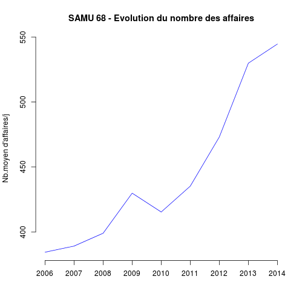

Analyse SAMU
========================================================


```r
library("xts")
```

```
## Loading required package: zoo
## 
## Attaching package: 'zoo'
## 
## Les objets suivants sont masqués from 'package:base':
## 
##     as.Date, as.Date.numeric
```

```r
library("zoo")
library("lubridate")

load("samu_archive.Rda")

# on met à NA les enregistrements où le nombre d'affaires < 10
d[d$affaires < 10, ] <- NA

# année courante et nb de jours
an_c <- 2013
j1 <- as.Date(paste0(an_c, "-01-01"))
j2 <- as.Date(paste0(an_c, "-12-31"))
n <- as.numeric(j2 - j1)
n
```

```
## [1] 364
```

```r

names(d)
```

```
##  [1] "date"        "service"     "affaires"    "primaires"   "secondaires"
##  [6] "néonat"      "TIIH"        "ASSU"        "VSAV"        "conseils"   
## [11] "Medecins"
```

```r
str(d)
```

```
## 'data.frame':	5576 obs. of  11 variables:
##  $ date       : Date, format: "2006-12-31" "2006-12-30" ...
##  $ service    : Factor w/ 2 levels "SAMU 67","SAMU 68": 1 1 1 1 1 1 1 1 1 1 ...
##  $ affaires   : num  1450 1202 753 744 851 ...
##  $ primaires  : num  34 36 20 37 41 36 28 40 48 48 ...
##  $ secondaires: num  5 8 12 8 10 2 6 3 7 11 ...
##  $ néonat     : num  0 0 0 0 0 0 0 0 0 0 ...
##  $ TIIH       : num  0 0 0 0 0 0 0 0 0 0 ...
##  $ ASSU       : num  124 110 80 75 123 108 115 96 100 101 ...
##  $ VSAV       : num  18 6 13 13 12 11 12 12 18 15 ...
##  $ conseils   : num  150 92 50 84 64 145 185 145 117 47 ...
##  $ Medecins   : num  329 209 76 62 61 371 337 354 151 51 ...
```

```r
summary(d)
```

```
##       date               service        affaires      primaires   
##  Min.   :2006-01-01   SAMU 67:2919   Min.   :  78   Min.   : 5.0  
##  1st Qu.:2007-12-10   SAMU 68:2654   1st Qu.: 387   1st Qu.:19.0  
##  Median :2009-11-06   NA's   :   3   Median : 578   Median :28.0  
##  Mean   :2009-12-04                  Mean   : 608   Mean   :28.8  
##  3rd Qu.:2011-10-05                  3rd Qu.: 732   3rd Qu.:37.0  
##  Max.   :2014-01-05                  Max.   :2194   Max.   :89.0  
##  NA's   :3                           NA's   :3      NA's   :3     
##   secondaires        néonat           TIIH            ASSU      
##  Min.   : 0.00   Min.   :0.000   Min.   :0.000   Min.   :  0.0  
##  1st Qu.: 4.00   1st Qu.:0.000   1st Qu.:0.000   1st Qu.: 28.0  
##  Median : 6.00   Median :0.000   Median :0.000   Median : 84.0  
##  Mean   : 6.98   Mean   :0.658   Mean   :0.002   Mean   : 71.6  
##  3rd Qu.: 9.00   3rd Qu.:1.000   3rd Qu.:0.000   3rd Qu.:102.0  
##  Max.   :34.00   Max.   :8.000   Max.   :7.000   Max.   :160.0  
##  NA's   :3       NA's   :3       NA's   :3       NA's   :3      
##       VSAV          conseils      Medecins    
##  Min.   :  2.0   Min.   : 20   Min.   :  0.0  
##  1st Qu.: 18.0   1st Qu.: 58   1st Qu.: 42.0  
##  Median : 34.0   Median :103   Median : 55.0  
##  Mean   : 42.7   Mean   :117   Mean   : 88.9  
##  3rd Qu.: 66.0   3rd Qu.:144   3rd Qu.:119.0  
##  Max.   :120.0   Max.   :599   Max.   :593.0  
##  NA's   :3       NA's   :3     NA's   :3
```

Records
=======

maximaux
---------

```r

d[d$affaires == max(d$affaires, na.rm = T) & !is.na(d$date), ]
```

```
##            date service affaires primaires secondaires néonat TIIH ASSU
## 2176 2009-12-26 SAMU 67     2194        54           5      0    0  137
##      VSAV conseils Medecins
## 2176   34      200      581
```

```r
d[d$primaires == max(d$primaires, na.rm = T) & !is.na(d$date), ]
```

```
##            date service affaires primaires secondaires néonat TIIH ASSU
## 2442 2009-04-04 SAMU 67     1168        89           5      0    0  131
##      VSAV conseils Medecins
## 2442   19      105      194
```

```r
d[d$secondaires == max(d$secondaires, na.rm = T) & !is.na(d$date), ]
```

```
##            date service affaires primaires secondaires néonat TIIH ASSU
## 1715 2008-04-02 SAMU 67      740        36          34      1    0  103
##      VSAV conseils Medecins
## 1715   14       39       68
```

```r
d[d$ASSU == max(d$ASSU, na.rm = T) & !is.na(d$date), ]
```

```
##            date service affaires primaires secondaires néonat TIIH ASSU
## 1807 2008-01-01 SAMU 67     1667        46           5      1    0  160
##      VSAV conseils Medecins
## 1807   26      215      308
```

```r
d[d$VSAV == max(d$VSAV, na.rm = T) & !is.na(d$date), ]
```

```
##            date service affaires primaires secondaires néonat TIIH ASSU
## 5534 2013-12-14 SAMU 68      672        13          11      0    0   24
##      VSAV conseils Medecins
## 5534  120      298       90
```

```r
d[d$conseils == max(d$conseils, na.rm = T) & !is.na(d$date), ]
```

```
##           date service affaires primaires secondaires néonat TIIH ASSU
## 363 2006-12-26 SAMU 68      888        16           7      1    0   73
##     VSAV conseils Medecins
## 363   38      599      403
```

```r
d[d$Medecins == max(d$Medecins, na.rm = T) & !is.na(d$date), ]
```

```
##            date service affaires primaires secondaires néonat TIIH ASSU
## 1447 2008-12-26 SAMU 67     1911        51           5      1    0  126
##      VSAV conseils Medecins
## 1447   38      246      593
```

minimaux
--------

```r
d[d$affaires == min(d$affaires, na.rm = T) & !is.na(d$date), ]
```

```
##           date service affaires primaires secondaires néonat TIIH ASSU
## 322 2006-02-05 SAMU 67       78        28           5      0    0   97
##     VSAV conseils Medecins
## 322    9       64      105
```

```r
d[d$primaires == min(d$primaires, na.rm = T) & !is.na(d$date), ]
```

```
##            date service affaires primaires secondaires néonat TIIH ASSU
## 3391 2010-08-31 SAMU 68      336         5           6      0    0   11
## 4115 2011-06-12 SAMU 68      682         5           4      0    0    9
## 4220 2011-02-27 SAMU 68      549         5           4      0    0    9
## 4690 2012-11-15 SAMU 68      503         5           5      0    0   10
## 4702 2012-11-03 SAMU 68      625         5           4      0    0    9
##      VSAV conseils Medecins
## 3391   54      109       32
## 4115   94      316      131
## 4220   46      344      125
## 4690   63      118       19
## 4702   75      219       86
```

```r
d[d$secondaires == min(d$secondaires, na.rm = T) & !is.na(d$date), ]
```

```
##            date service affaires primaires secondaires néonat TIIH ASSU
## 77   2006-10-17 SAMU 67      608        38           0      0    7   86
## 377  2006-12-12 SAMU 68      307        19           0      0    0   63
## 380  2006-12-09 SAMU 68      430        17           0      0    0   72
## 387  2006-12-02 SAMU 68      438        27           0      0    0   67
## 578  2006-05-27 SAMU 68      492        33           0      0    0   93
## 591  2006-05-14 SAMU 68      485        26           0      0    0   58
## 607  2006-04-27 SAMU 68      303        16           0      0    0   68
## 654  2006-03-05 SAMU 68      621        34           0      0    0   87
## 795  2007-10-13 SAMU 67      840        37           0      1    0  101
## 1123 2007-11-18 SAMU 68      480        17           0      0    0   76
## 1262 2007-07-02 SAMU 68      336        26           0      0    0   77
## 1335 2007-04-20 SAMU 68      306        17           0      0    0   53
## 1460 2008-12-13 SAMU 67      848        27           0      1    0  115
## 1874 2008-10-25 SAMU 68      429        27           0      0    0   76
## 1946 2008-08-14 SAMU 68      333        18           0      0    0   62
## 1952 2008-08-08 SAMU 68      292        11           0      0    0   54
## 1990 2008-06-30 SAMU 68      372        29           0      0    0   70
## 2086 2008-03-25 SAMU 68      366        19           0      0    0   60
## 2288 2009-09-05 SAMU 67      713        40           0      0    0  101
## 2607 2009-10-25 SAMU 68      490        20           0      0    0    0
## 2863 2009-02-15 SAMU 68      646        18           0      0    0    0
## 2872 2009-02-06 SAMU 68      357        15           0      0    0    0
## 3135 2010-05-16 SAMU 67     1277        32           0      0    0   94
## 3593 2010-02-08 SAMU 68      358        16           0      0    0   16
## 3667 2011-11-26 SAMU 67      833        30           0      0    0   83
## 3722 2011-10-02 SAMU 67     1297        30           0      0    0  111
## 3975 2011-01-22 SAMU 67      972        28           0      0    0  100
## 4058 2011-08-11 SAMU 68      333        17           0      0    0   17
## 4287 2012-12-22 SAMU 67     1339        59           0      0    0  109
## 4613 2012-01-31 SAMU 67      733        41           0      0    0  106
## 4787 2012-08-09 SAMU 68      437        15           0      0    0   15
## 4882 2013-06-16 SAMU 67      574        46           0      0    0   90
## 5157 2013-04-14 SAMU 68      750        23           0      0    0   23
## 5388 2013-10-27 SAMU 67      459        22           0      0    0   76
## 5418 2013-10-28 SAMU 68      432        17           0      0    0   17
##      VSAV conseils Medecins
## 77     11       47       51
## 377    52      102       39
## 380    53      190      126
## 387    58      187      145
## 578    66      308      123
## 591    57      398      127
## 607    41      135       38
## 654    59      422      153
## 795    17      100      129
## 1123   33      208      165
## 1262   63      102       45
## 1335   48       87       44
## 1460   19      106      194
## 1874   66      170      109
## 1946   62      133       36
## 1952   45      120       34
## 1990   86      132       48
## 2086   59      124       41
## 2288   18       97      141
## 2607   83      199      172
## 2863   94      246      228
## 2872   72      131       38
## 3135   29      177      214
## 3593   64      145       51
## 3667   21      131      140
## 3722   27      175      257
## 3975   23      121      170
## 4058   65      111       38
## 4287   34      129      235
## 4613   20       59       50
## 4787  102      106       34
## 4882   44      141      179
## 5157  109      190      109
## 5388   15       92      199
## 5418   72      133       27
```

```r
# d[d$ASSU==min(d$ASSU, na.rm=T) & !is.na(d$date),] d[d$VSAV==min(d$VSAV,
# na.rm=T) & !is.na(d$date),] d[d$conseils==min(d$conseils, na.rm=T) &
# !is.na(d$date),] d[d$Medecins==min(d$Medecins, na.rm=T) & !is.na(d$date),]
```


SAMU 67
========


```r

s67 <- d[d$service == "SAMU 67", ]
# supprime les lignes dupliquées:
s67 <- s67[!duplicated(s67$date), ]


xts_s67 <- as.xts(s67, order.by = s67$date)

a <- zoo(s67$affaires, s67$date)
plot(a, col = "palegreen", main = "Activité du SAMU 67", ylab = "Nombre d'affaires")
```

 

```r

b <- zoo(s67$conseils, s67$date)
plot(b, col = "palegreen", main = "Activité du SAMU 67", ylab = "Nombre de conseils")
```

 

```r


a <- tapply(s67$affaires, year(s67$date), sum)
# activité en nombre d'affaires
a
```

```
##   2006   2007   2008   2009   2010   2011   2012   2013   2014 
## 258065 291264 287750 286857 279600 290592 323647 223414   4961
```

```r

# box plot. On détermine la journée la plus active en triant les
# enregistrements par nb affaires décroissant. ord[1] correspond à la ligne
# où le nb d'affaires est le plus élevé. Il s'agxit de 2006, ce qui
# correspond à la colonne n°4. On marque la date en face du repère.
boxplot(s67$affaires ~ year(s67$date), main = "Activité du SAMU 67", ylab = "Nombre d'affaires")

ord <- order(s67$affaires, decreasing = TRUE)
s67[ord[1], ]
```

```
##            date service affaires primaires secondaires néonat TIIH ASSU
## 2176 2009-12-26 SAMU 67     2194        54           5      0    0  137
##      VSAV conseils Medecins
## 2176   34      200      581
```

```r
s67$date[ord[1]]
```

```
## [1] "2009-12-26"
```

```r
text(4, s67$affaires[ord[1]], s67$date[ord[1]], cex = 0.6, pos = 4)
```

 


bilan de l'année
----------------
En 2013, une erreur informatique a entraîné une erreur dans le report de l'activité du SAMU67 du 24 avril 2013 au 1er novembre 2013, soit un peu plus de 6 mois:
- **ac67** correspond à l'ensemble de l'année 2013
- **ac67c** correspond aux mois 1-4 et 11-12 de 2013

```r
ac67 <- s67[year(s67$date) == an_c, ]
# nombre de jours renseignés
x <- as.numeric(max(ac67$date, na.rm = T) - min(ac67$date, na.rm = T))
round(x * 100/n, 2)
```

```
## [1] 100
```

```r

sac67 <- summary(ac67)
sac67
```

```
##       date               service       affaires      primaires   
##  Min.   :2013-01-01   SAMU 67:365   Min.   : 234   Min.   :16.0  
##  1st Qu.:2013-04-02   SAMU 68:  0   1st Qu.: 317   1st Qu.:31.0  
##  Median :2013-07-02   NA's   :  1   Median : 492   Median :36.0  
##  Mean   :2013-07-02                 Mean   : 612   Mean   :36.7  
##  3rd Qu.:2013-10-01                 3rd Qu.: 841   3rd Qu.:41.0  
##  Max.   :2013-12-31                 Max.   :1446   Max.   :60.0  
##  NA's   :1                          NA's   :1      NA's   :1     
##   secondaires        néonat          TIIH        ASSU            VSAV     
##  Min.   : 0.00   Min.   :0.00   Min.   :0   Min.   : 57.0   Min.   :12.0  
##  1st Qu.: 5.00   1st Qu.:0.00   1st Qu.:0   1st Qu.: 81.0   1st Qu.:24.0  
##  Median : 8.00   Median :1.00   Median :0   Median : 91.0   Median :28.0  
##  Mean   : 7.59   Mean   :1.35   Mean   :0   Mean   : 92.7   Mean   :28.7  
##  3rd Qu.:10.00   3rd Qu.:2.00   3rd Qu.:0   3rd Qu.:103.0   3rd Qu.:33.0  
##  Max.   :19.00   Max.   :8.00   Max.   :0   Max.   :153.0   Max.   :67.0  
##  NA's   :1       NA's   :1      NA's   :1   NA's   :1       NA's   :1     
##     conseils      Medecins  
##  Min.   : 26   Min.   : 21  
##  1st Qu.: 51   1st Qu.: 42  
##  Median : 67   Median : 53  
##  Mean   : 78   Mean   : 91  
##  3rd Qu.: 94   3rd Qu.:122  
##  Max.   :252   Max.   :356  
##  NA's   :1     NA's   :1
```

```r

# comparaison avec l'année précédante:
ap67 <- s67[year(s67$date) == an_c - 1, ]
sap67 <- summary(ap67)
sap67
```

```
##       date               service       affaires      primaires   
##  Min.   :2012-01-01   SAMU 67:366   Min.   : 501   Min.   :20.0  
##  1st Qu.:2012-04-01   SAMU 68:  0   1st Qu.: 742   1st Qu.:37.0  
##  Median :2012-07-01   NA's   :  1   Median : 840   Median :42.0  
##  Mean   :2012-07-01                 Mean   : 884   Mean   :42.5  
##  3rd Qu.:2012-09-30                 3rd Qu.:1006   3rd Qu.:47.0  
##  Max.   :2012-12-31                 Max.   :1950   Max.   :65.0  
##  NA's   :1                          NA's   :1      NA's   :1     
##   secondaires       néonat          TIIH        ASSU          VSAV     
##  Min.   : 0.0   Min.   :0.00   Min.   :0   Min.   : 74   Min.   : 8.0  
##  1st Qu.: 5.0   1st Qu.:0.00   1st Qu.:0   1st Qu.: 97   1st Qu.:23.0  
##  Median : 8.0   Median :1.00   Median :0   Median :104   Median :26.0  
##  Mean   : 8.1   Mean   :1.42   Mean   :0   Mean   :104   Mean   :27.2  
##  3rd Qu.:10.0   3rd Qu.:2.00   3rd Qu.:0   3rd Qu.:111   3rd Qu.:31.0  
##  Max.   :19.0   Max.   :7.00   Max.   :0   Max.   :155   Max.   :45.0  
##  NA's   :1      NA's   :1      NA's   :1   NA's   :1     NA's   :1     
##     conseils        Medecins  
##  Min.   : 29.0   Min.   : 30  
##  1st Qu.: 52.0   1st Qu.: 51  
##  Median : 64.0   Median : 61  
##  Mean   : 78.6   Mean   :103  
##  3rd Qu.: 94.0   3rd Qu.:141  
##  Max.   :292.0   Max.   :483  
##  NA's   :1       NA's   :1
```

```r

# analyse en ne trenant compte que des mois pleins (mois 1-4 et 11-12)
ac67c <- ac67[ac67$date < "2013-04-24" | ac67$date > "2013-11-01", ]
summary(ac67c)
```

```
##       date               service       affaires      primaires   
##  Min.   :2013-01-01   SAMU 67:173   Min.   : 293   Min.   :19.0  
##  1st Qu.:2013-02-13   SAMU 68:  0   1st Qu.: 760   1st Qu.:35.0  
##  Median :2013-03-28   NA's   :  1   Median : 849   Median :40.0  
##  Mean   :2013-06-02                 Mean   : 897   Mean   :40.5  
##  3rd Qu.:2013-11-18                 3rd Qu.:1054   3rd Qu.:46.0  
##  Max.   :2013-12-31                 Max.   :1446   Max.   :60.0  
##  NA's   :1                          NA's   :1      NA's   :1     
##   secondaires        néonat          TIIH        ASSU          VSAV     
##  Min.   : 1.00   Min.   :0.00   Min.   :0   Min.   : 71   Min.   :13.0  
##  1st Qu.: 5.00   1st Qu.:0.00   1st Qu.:0   1st Qu.: 96   1st Qu.:25.0  
##  Median : 8.00   Median :1.00   Median :0   Median :103   Median :30.0  
##  Mean   : 8.06   Mean   :1.51   Mean   :0   Mean   :104   Mean   :30.4  
##  3rd Qu.:11.00   3rd Qu.:2.00   3rd Qu.:0   3rd Qu.:111   3rd Qu.:35.0  
##  Max.   :19.00   Max.   :8.00   Max.   :0   Max.   :153   Max.   :67.0  
##  NA's   :1       NA's   :1      NA's   :1   NA's   :1     NA's   :1     
##     conseils        Medecins  
##  Min.   : 35.0   Min.   : 33  
##  1st Qu.: 63.0   1st Qu.: 50  
##  Median : 76.0   Median : 59  
##  Mean   : 91.3   Mean   :108  
##  3rd Qu.:109.0   3rd Qu.:155  
##  Max.   :252.0   Max.   :356  
##  NA's   :1       NA's   :1
```

```r

x <- d[d$date < "2013-04-24" | d$date > "2013-11-01", c("date", "affaires")]
boxplot(x$affaires ~ year(x$date), main = "Activité du SAMU 67", ylab = "Nombre d'affaires", 
    sub = "2013 = MOIS 1-4 et 11-12", col = c("red", "red", "red", "red", "red", 
        "red", "red", "yellow", "red"))
```

 


SAMU 68
=======

```r
s68 <- d[d$service == "SAMU 68", ]
# supprime les lignes dupliquées:
s68 <- s68[!duplicated(s68$date), ]

# nombre de jours renseignés
x <- max(s68$date) - min(s68$date)
round(x * 100/n, 2)
```

```
## Time difference of NA days
```

```r

xts_s68 <- as.xts(s68, order.by = s68$date)

a <- zoo(s68$affaires, s68$date)
plot(a, col = "palegreen", main = "Activité du SAMU 68", ylab = "Nombre d'affaires")
```

 

```r

b <- zoo(s68$conseils, s68$date)
plot(b, col = "palegreen", main = "Activité du SAMU 68", ylab = "Nombre de conseils")
```

 

```r


a <- tapply(s68$affaires, year(s68$date), sum)
# activité en nombre d'affaires
a
```

```
##   2006   2007   2008   2009   2010   2011   2012   2013   2014 
## 136839 140076 144826 154304 149929 122298  91300 192868   2723
```

```r

# box plot. On détermine la journée la plus active en triant les
# enregistrements par nb affaires décroissant. ord[1] correspond à la ligne
# où le nb d'affaires est le plus élevé. Il s'agit de 2006, ce qui
# correspond à la colonne n°4. On marque la date en face du repère.
boxplot(s68$affaires ~ year(s68$date), main = "Activité du SAMU 68", ylab = "Nombre d'affaires")

ord <- order(s68$affaires, decreasing = TRUE)
s68[ord[1], ]
```

```
##            date service affaires primaires secondaires néonat TIIH ASSU
## 1813 2008-12-26 SAMU 68     1074        18           4      0    0    0
##      VSAV conseils Medecins
## 1813  107      556      474
```

```r
s68$date[ord[1]]
```

```
## [1] "2008-12-26"
```

```r
text(4, s68$affaires[ord[1]], s68$date[ord[1]], cex = 0.6, pos = 4)
```

 

Les 2 SAMU ensembles
--------------------
- **at** permet de décaler les boxplot pour qu'ils ne soient pas superposés
- **bexwex** permet de diminuer la largeur d'un boxplot
- **add** pour mettre les 2 graphiques sur le même dessin
- **outline** = FALSE, ne dessine pas les observations extrèmes


```r
x <- d[d$date < "2013-04-24" | d$date > "2013-11-01", c("date", "affaires")]
boxplot(x$affaires ~ year(x$date), main = "Activité du SAMU 67", ylab = "Nombre d'affaires", 
    sub = "2013 = MOIS 1-4 et 11-12", col = c("red", "red", "red", "red", "red", 
        "red", "red", "yellow", "red"))
```

 

```r

boxplot(x$affaires ~ year(x$date), main = "Activité des SAMU d'Alsace", ylab = "Nombre d'affaires", 
    sub = "MOIS 1-4 et 11-12", col = c("red", "red", "red", "red", "red", "red", 
        "red", "yellow", "red"), at = 1:9 - 0.3, boxwex = 0.25, outline = FALSE)

boxplot(s68$affaires ~ year(s68$date), col = "green", add = TRUE, at = 1:9 + 
    0.1, boxwex = 0.25, names = c("", "", "", "", "", "", "", "", ""), outline = FALSE)

legend(1, 1400, c("SAMU 67 ", "SAMU 68"), fill = c("red", "green"))
```

 


